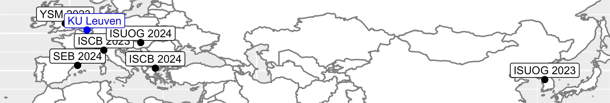

```{r echo = FALSE,results='asis',message=FALSE,warning=FALSE}
library(openxlsx)
library(gt)
library(dplyr)
conferences <- read.xlsx("conferences.xlsx")
conferences <- conferences %>% arrange(-Year,-Month)
# conferences %>% gt()

# Function to generate Markdown for each row
generate_markdown <- function(row) {
  links <- paste0('[', row$Link_1_name, '](', row$Link_1, ')')
  
  if (!is.na(row$Link_2)) {
    links <- paste0(links, ' | [', row$Link_2_name, '](', row$Link_2, ')')
  }
  
  paste0(
    "**", row$Conference, "** (", row$Code_Name," ",row$Year,")  \n",
    row$Title,"  ",
    links, "  \n\n---\n"
  )
}

# Apply the function to each row and concatenate the results
markdown_content <- apply(conferences, 1, function(x) generate_markdown(as.list(x)))
markdown_content <- paste(markdown_content, collapse = "\n")

# Print the Markdown content
cat(markdown_content)
```
```{r map_leaflet, include = TRUE, echo = FALSE,message=FALSE,warning=FALSE}
library(ggmap)
library(ggplot2)
library(dplyr)
library(openxlsx)
library(tidygeocoder)
library(tidyverse)
library(leaflet)
library(sf)
library(maps)
library(ggpubr)
library(readxl)

world <- map_data('world')

conferences <- read_excel(path = "conferences.xlsx")
geocoded_cities <- tidygeocoder::geocode(.tbl = conferences,city = Location)

my_uni <- tidygeocoder::geocode(.tbl = data.frame(Location = "Leuven"), city = Location)

map <- leaflet(data = geocoded_cities) %>%
  addTiles() %>%
  addCircleMarkers(~long, ~lat,popup = paste(geocoded_cities$Code_Name, geocoded_cities$Year,",",geocoded_cities$Location), color = "red") %>% 
  addCircleMarkers(data = my_uni,~long, ~lat,popup = paste("KU Leuven"), color = "blue")

map  


```

<!--  -->
