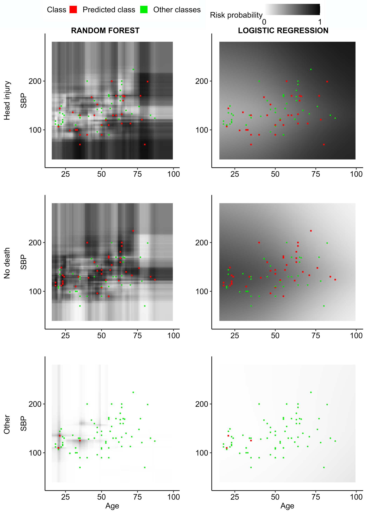
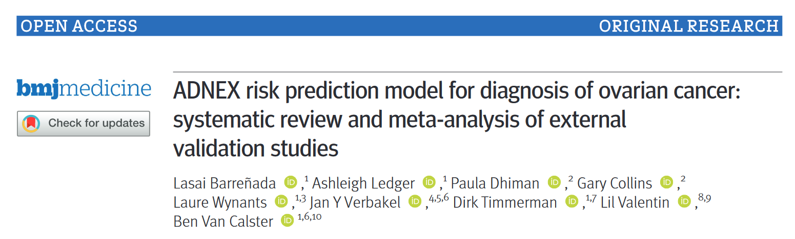

### Understanding random forests and overfitting: a visualization and simulation study

<a href="https://arxiv.org/abs/2402.18612" target="_blank">arXiv Preprint</a> \| <a href="https://osf.io/y5tqv/" target="_blank">Code</a> 

Random forests have become popular for clinical risk prediction modelling. In a case study on predicting ovarian malignancy, we observed training c-statistics close to 1. Although this suggests overfitting, performance was competitive on test data. We aimed to understand the behaviour of random forests by (1) visualizing data space in three real world case studies and (2) a simulation study. For the case studies, risk estimates were visualised using heatmaps in a 2-dimensional subspace. The simulation study included 48 logistic data generating mechanisms (DGM), varying the predictor distribution, the number of predictors, the correlation between predictors, the true c-statistic and the strength of true predictors. For each DGM, 1000 training datasets of size 200 or 4000 were simulated and RF models trained with minimum node size 2 or 20 using ranger package, resulting in 192 scenarios in total. The visualizations suggested that the model learned spikes of probability around events in the training set. A cluster of events created a bigger peak, isolated events local peaks. In the simulation study, median training c-statistics were between 0.97 and 1 unless there were 4 or 16 binary predictors with minimum node size 20. Median test c-statistics were higher with higher events per variable, higher minimum node size, and binary predictors. Median training slopes were always above 1, and were not correlated with median test slopes across scenarios (correlation -0.11). Median test slopes were higher with higher true c-statistic, higher minimum node size, and higher sample size. Random forests learn local probability peaks that often yield near perfect training c-statistics without strongly affecting c-statistics on test data. When the aim is probability estimation, the simulation results go against the common recommendation to use fully grown trees in random forest models.

### ADNEX risk prediction model for diagnosis of ovarian cancer: systematic review and meta-analysis of external validation studies

<a href="https://bmjmedicine.bmj.com/content/3/1/e000817" target="_blank">Published paper</a> \| <a href="https://osf.io/jtsvd/" target="_blank">OSF Repository including code</a> 

**Objectives**: To conduct a systematic review of studies externally validating the ADNEX (Assessment of Different Neoplasias in the adnexa) model for diagnosis of ovarian cancer and to present a meta-analysis of its performance.

**Design**: Systematic review and meta-analysis of external validation studies

**Data sources**: Medline, Embase, Web of Science, Scopus, and Europe PMC, from 15 October 2014 to 15 May 2023.

**Eligibility criteria** **for selecting studies:** All external validation studies of the performance of ADNEX, with any study design and any study population of patients with an adnexal mass. Two independent reviewers extracted the data. Disagreements were resolved by discussion. Reporting quality of the studies was scored with the TRIPOD (Transparent Reporting of a multivariable prediction model for Individual Prognosis Or Diagnosis) reporting guideline, and methodological conduct and risk of bias with PROBAST (Prediction model Risk Of Bias Assessment Tool). Random effects meta-analysis of the area under the receiver operating characteristic curve (AUC), sensitivity and specificity at the 10% risk of malignancy threshold, and net benefit and relative utility at the 10% risk of malignancy threshold were performed.

**Results**: 47 studies (17007 tumours) were included, with a median study sample size of 261 (range 24-4905). On average, 61% of TRIPOD items were reported. Handling of missing data, justification of sample size, and model calibration were rarely described. 91% of validations were at high risk of bias, mainly because of the unexplained exclusion of incomplete cases, small sample size, or no assessment of calibration. The summary AUC to distinguish benign from malignant tumours in patients who underwent surgery was 0.93 (95% confidence interval 0.92 to 0.94, 95% prediction interval 0.85 to 0.98) for ADNEX with the serum biomarker, cancer antigen 125 (CA125), as a predictor (9202 tumours, 43 centres, 18 countries, and 21 studies) and 0.93 (95% confidence interval 0.91 to 0.94, 95% prediction interval 0.85 to 0.98) for ADNEX without CA125 (6309 tumours, 31 centres, 13 countries, and 12 studies). The estimated probability that the model has use clinically in a new centre was 95% (with CA125) and 91% (without CA125). When restricting analysis to studies with a low risk of bias, summary AUC values were 0.93 (with CA125) and 0.91 (without CA125), and estimated probabilities that the model has use clinically were 89% (with CA125) and 87% (without CA125).

Conclusions: The results of the meta-analysis indicated that ADNEX performed well in distinguishing between benign and malignant tumours in populations from different countries and settings, regardless of whether the serum biomarker, CA125, was used as a predictor. A key limitation was that calibration was rarely assessed.

**Systematic review registration**: PROSPERO CRD42022373182.
